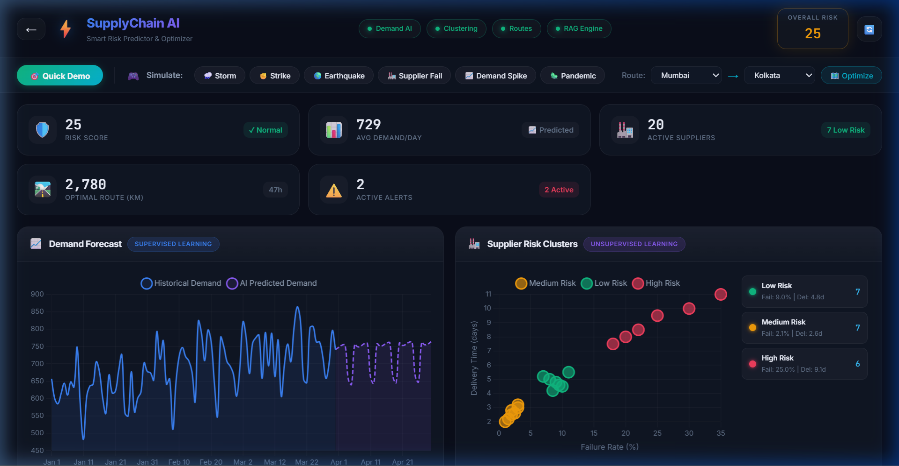

# AI / Machine Learning Engine 🧠

This folder contains the core mathematical and predictive models powering the Smart Supply Chain Risk Predictor & Optimizer.

## 1. Localized Demand Prediction (Supervised Learning)
Instead of static demand forecasting, this project implements a dynamic **Linear Regression** model utilizing `scikit-learn` that trains and infers on-the-fly.

- **How it Works**: When a logistics manager selects a route (e.g., Chennai to Mumbai), the backend queries historical demand strictly for the cities on that route.
- **Features Extracted**: The model vectorizes complex temporal data:
  - Day of the week & Weekend binary flag
  - Month (converted to Sine/Cosine variables to preserve cyclical seasonality)
  - 7-day and 30-day Rolling Averages
  - Long-term growth trends
- **Confidence Intervals**: The model calculates the residual standard deviation on the validation set to dynamically output ±1σ confidence bounds, visualizing potential maximum and minimum inventory requirements.

## 2. Supplier Risk Classification (Unsupervised Learning)
To objectively categorize suppliers, we utilize **K-Means Clustering**.

- **How it Works**: Suppliers in the active route network are plotted based on their historical `Failure Rate (%)` and `Delivery Time (days)`.
- **Clustering Algorithm**: Standardizes the data (using `StandardScaler`) and applies K-Means (k=3) to automatically segment suppliers into qualitative tiers:
  - **Low Risk** (Green)
  - **Medium Risk** (Yellow)
  - **High Risk** (Red)
- **Evaluation Metric**: The pipeline computes the **Silhouette Score** to mathematically prove the density and separation of the clusters, ensuring that risk categorizations are highly accurate.

