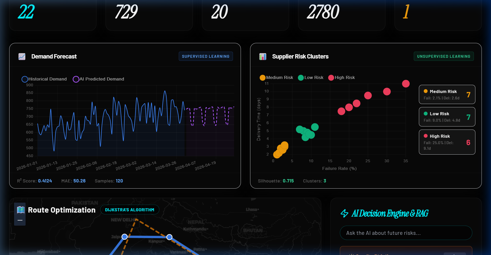

# Data Visualization Charts 📊

The Smart Supply Chain dashboard relies heavily on interactive, high-fidelity data visualizations rendering complex machine-learning outputs in real-time.

## Libraries & Integration
- **Frontend Stack**: Built on React 19 and TailwindCSS.
- **Charting Engine**: We utilized **Chart.js 4** integrated via `react-chartjs-2`, allowing seamless mapping of React component states directly to canvas drawings.

## Visualization Types

### 1. Demand Forecast (Line Chart with Confidence Intervals)
- The ML model returns predictions (with upper, lower bounds, and expected values).
- The `Historical Demand` (solid blue line) and `AI Predicted Demand` (dashed purple line) are plotted chronologically to allow operators to see the continuous temporal structure.
- **Dynamic Extrapolation**: The X-axis scales and ticks natively according to the simulated timeline (past 90 days, next 30 days projection).

### 2. Supplier Risk Clustering (Scatter Plot)
- Driven by our K-Means backend module, suppliers are rendered as individual coordinates mapped on two continuous variables (Delivery Time vs. Failure Rate).
- **Algorithmic Coloring**: The dots are distinctively colored (Green/Yellow/Red) based on the qualitative "Cluster Label" assigned to them dynamically in the backend. 
- **Legend Bindings**: A custom sidebar legend dynamically summarizes the clusters for the user's immediate operational clarity.

