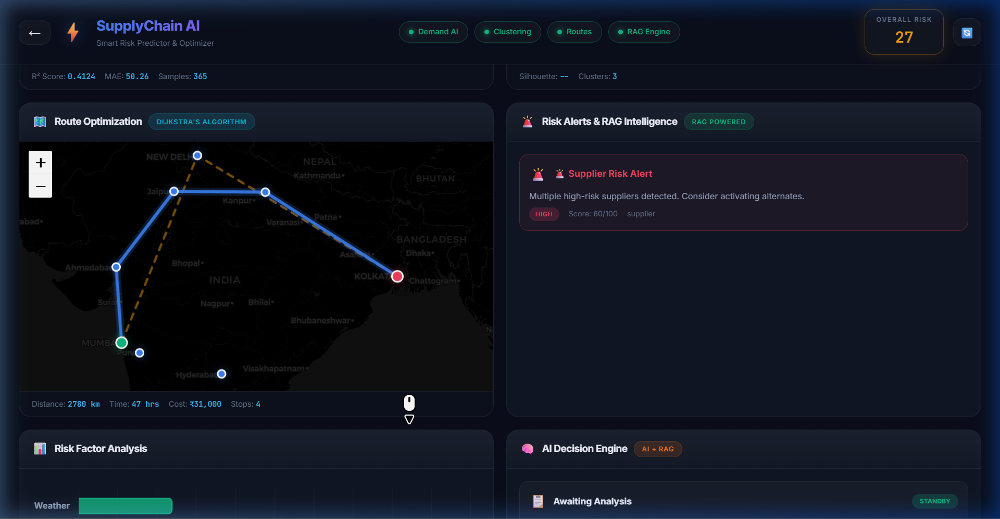

# Route Optimization Maps 🗺️

Location intelligence is critical to the Smart Supply Chain platform. The application provides an interactive geographic interface to track optimized trucking routes between logistics hubs.

## 1. Map Visualization Layer
- We use **React Leaflet** to render the 2D basemaps and interactive components.
- **Custom Basemaps:** The application connects to CartoDB dark matter maps (`https://{s}.basemaps.cartocdn.com/dark_all/{z}/{x}/{y}{r}.png`) to enforce a highly professional, dark-themed UI that matches the rest of the dashboard analytics.
- **Polyline Injections:** We built a custom `SEA_WAYPOINTS` coordinate injector in the frontend. This completely prevents the optimized polylines from traveling randomly over bodies of water (e.g., crossing the Bay of Bengal between Chennai and Kolkata) and intelligently hugs the actual coastal/land trucking corridors!

## 2. Route Backend Optimization (A* Algorithm)
The `backend/models/route_optimizer.py` script replaces standard brute force network paths with an optimized **A-Star (A*) Graph Search**.

- **Haversine Heuristic:** To aggressively optimize the pathfinding compute times for trucking distances, A* looks at the remaining great-circle distance (using Haversine) between the current node and the destination. Standard Dijkstra's would blindly verify the whole map.
- **Cost Scaling:** Cost involves both raw `travel_time_hours` and the real-time `risk_factor` associated with the edges. A completely clear highway is preferred over a shorter road suffering from a localized risk alert.

