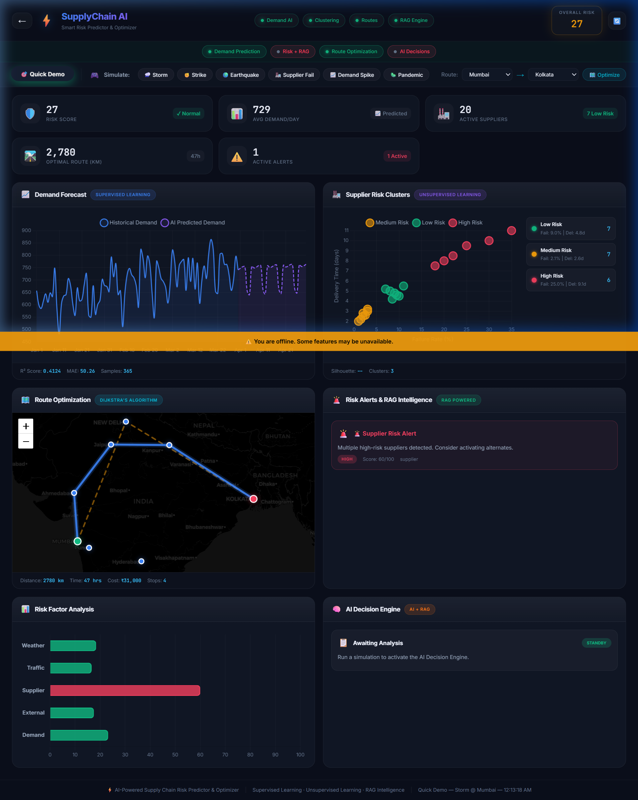

# Retrieval-Augmented Generation (RAG) 📚

This module outlines the intelligence engine (`backend/models/rag_engine.py`) that marries historical, structured supply chain documentation with modern Large Language Models (LLMs) to formulate accurate, contextually aware logistical mitigation strategies.

## Hybrid Retrieval Architecture
Rather than simple semantic search, the RAG engine uses a dual-pronged **Hybrid Lexical-Dense Search Algorithm**.
1. **TF-IDF Search Vectorizer:** Scans for exact keyword matches (e.g., "Pandemic", "Flood Mumbai").
2. **BM25 Search Algorithm:** A probabilistic model parsing document relevancy against the user's specific risk query, handling the frequencies of unique terms.
Currently, this runs on an in-memory document corpus composed of historical logistics mitigation logs, safety reports, and regulatory compliance protocols for the entire supply chain footprint.

## Google Gemini 2.5 Flash Synthesis
After the hybrid retrieve step extracts the top `n` most valuable documents concerning a disruption, the content is piped directly into **Google Gemini 2.5 Flash** via the `google.generativeai` SDK. 
- **System Prompting:** The RAG module embeds the retrieved context into a massive supply chain master-prompt template. 
- **Outcome:** The user (e.g., Supply Chain Director) receives highly formatted, actionable insights detailing:
  - Estimated impact severity mapping.
  - Three real-world mitigation strategies (e.g., "Shift 12% of load out of the Kolkata hub immediately via alternative air cargo routes").

This ensures that the AI's advice is structurally sound, mitigating hallucinatory generation through rigid, factual grounding in internal supply chain standard operating environments.

