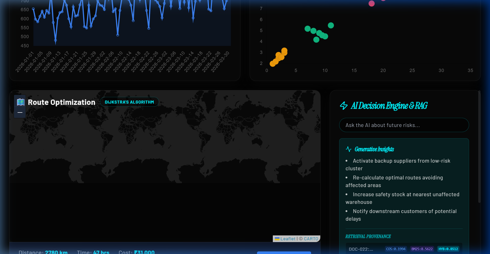
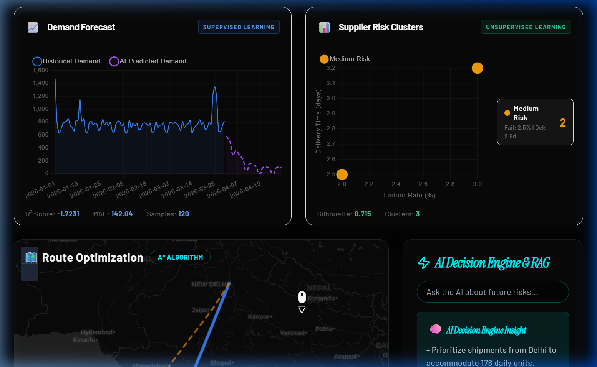
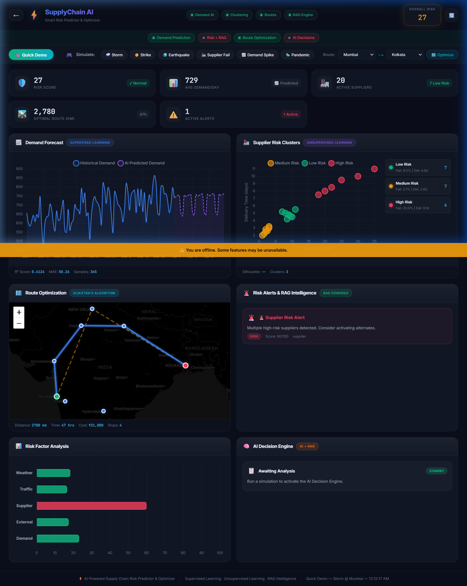

# AI-Powered Smart Supply Chain Risk Predictor & Optimizer

## Problem Statement

Modern supply chains are highly vulnerable to unpredictable disruptions (weather events, geopolitical shifts, labor strikes) and often rely on static, historical point-to-point routing. When disruptions occur, logistics companies lack the real-time, dynamic intelligence required to reroute shipments, adapt inventory reserves, and mitigate cascading monetary losses.

## Project Description

The **Smart Supply Chain Risk Predictor & Optimizer** is an elite, dynamic logistics dashboard that completely overhauls traditional supply chain management. By fusing traditional optimization algorithms (A\* Haversine) with Generative AI and Machine Learning, the platform provides hyper-localized operational intelligence.

**Core Features:**

- **Dynamic Route-Based Analytics:** Instead of generic national data, the dashboard computes demand forecasts, supplier reliability scores, and active risks _strictly based on the user-selected route_ (e.g., Chennai → Mumbai vs. Delhi → Mumbai).
- **ML Demand Forecasting:** Utilizes localized linear regression models trained on-the-fly to predict future demand requirements with computed ±1σ confidence bands.
- **Unsupervised Supplier Clustering:** Automatically categorizes active route suppliers into Low, Medium, and High-Risk tiers based on historical metrics like delivery times and failure rates.
- **Real-Time AI Decision Engine:** When a route is queried or a mock disruption triggered (e.g., a monsoon in Mumbai), the system feeds the data into Google Gemini to dynamically generate hyper-specific logistical constraints and rerouting instructions.

---

## Google AI Usage

### Tools / Models Used

- **Google Gemini 2.5 Flash** (`google.generativeai` SDK)

### How Google AI Was Used

Generative AI acts as the brains of our **Decision Engine & RAG Insight** feature.
Whenever a user selects a new optimized logistics route, or simulates a supply chain disruption (like a pandemic or severe storm), the backend aggregates the localized demand metrics, A\* distance, and risk factors into a structured prompt. This is fed directly into **Gemini 2.5 Flash**.

Gemini processes these complex, multi-factor variables in real-time and outputs highly professional, context-aware constraints (e.g., advising exactly how much safety stock to maintain at a specific warehouse hub based on impending weather, or prioritizing alternative transportation modalities). This replaces rigid, rule-based systems with flexible, intelligent supply chain decision-making.

---

## Proof of Google AI Usage

Attach screenshots in a `/proof` folder:


_(Screenshot demonstrating the AI Decision Engine generating hyper-local logistical constraints utilizing the Gemini API)._

---

## Screenshots

  
_(The main dashboard view showing optimal A_ routing, dynamic demand bounds, and clustered supplier metrics).\*


_(Simulating a localized supply chain disruption and its downstream effects)._

---

## Demo Video

[Watch Demo](#) _(Insert Google Drive link here)_

---

## Installation Steps

### 1. Clone the repository

```bash
git clone <your-repo-link>
cd "AI-Powered Smart Supply Chain Risk Predictor & Optimizer"
```

### 2. Backend Setup (Flask & AI)

```bash
cd backend

# Install Python dependencies
pip install -r requirements.txt

# Create an environment file and add your Google Gemini API Key
echo "GEMINI_API_KEY=your_api_key_here" > .env

# Re-seed the localized database
python seed_data.py

# Run the Flask backend (runs on http://localhost:5000)
python app.py
```

### 3. Frontend Setup (React/Vite)

Open a new terminal session.

```bash
cd frontend-react

# Install Node dependencies
npm install

# Run the Vite development server
npm run dev
```

The application will be available at `http://localhost:5173`. Select your starting and ending warehouses in the top simulation bar and click **Optimize Path** to generate the AI insights!
